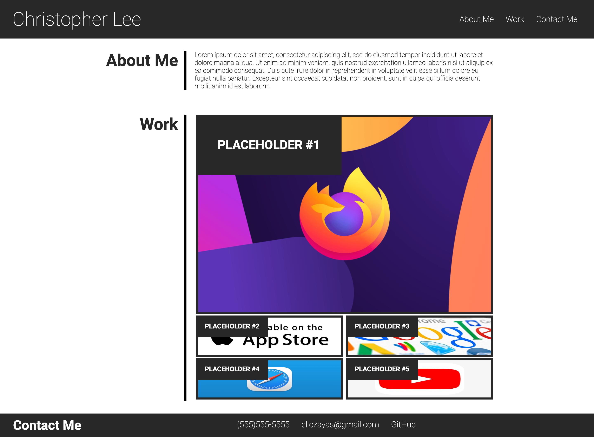

# Advanced CSS Challenge: Professional Portfolio

## Access

https://cl-czayas.github.io/module-2-challenge/

## Description

This website was created in order to showcase the work of its creator, and facilitate their contact information.

## Usage

After accessing the webpage, users can use the navigation links on the top right of the page to head directly to the section of content they are interested in.

## Credits

Code written by Christopher L. Cristóbal Zayas (cl-czayas).